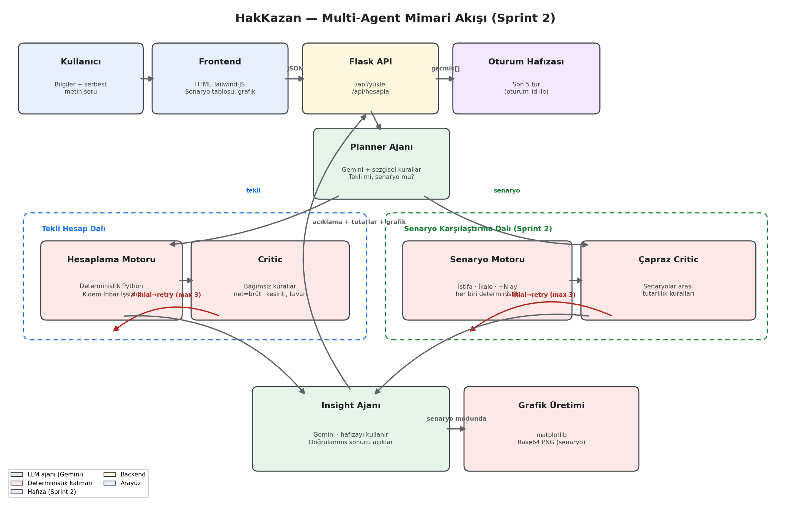
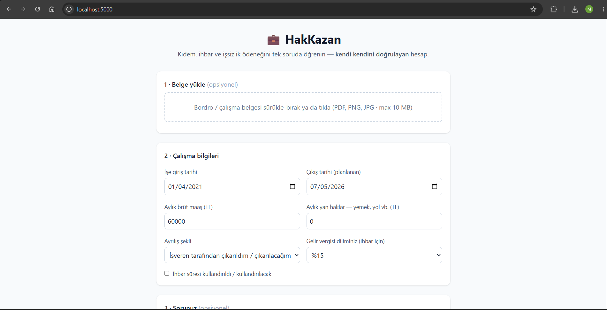
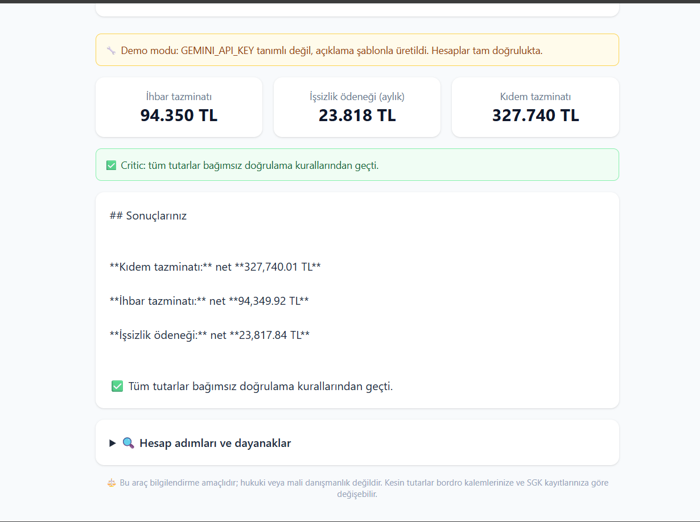

# Yapay Zeka ve Teknoloji Akademisi — Bootcamp 2026

## 👥 Takım Bilgileri

| Üye | Rol |
|---|---|
| **Taha Yavaş** | Scrum Master & Backend Developer |
| **Zuhal Tuana Yıldırım** | Product Owner & AI Developer |
| **Mühire Alkan** | Frontend Developer & UI Designer |

---

## 🚀 Ürün Bilgileri

### Ürün İsmi
**HakKazan** — AI-Powered Multi-Agent Compensation Calculator

### Ürün Açıklaması
HakKazan; çalışanların en kritik sorularından biri olan **"İşten ayrılırsam ne
alırım?"** sorusuna yanıt veren, çoklu yapay zekâ ajanları (multi-agent)
mimarisiyle çalışan bir kıdem tazminatı, ihbar tazminatı ve işsizlik ödeneği
hesaplama platformudur. Sprint 2 itibarıyla HakKazan tek bir hesabın ötesine
geçip **senaryo karşılaştırması** yapabiliyor: "istifa edersem ne kaybederim?",
"ikale yapsam ne olur?", "3 ay daha çalışsam ne değişir?" gibi sorulara
karşılaştırmalı, grafikli cevaplar üretiyor.

Mevcut internet hesaplayıcılarından temel farkı **güvenilirlik yaklaşımıdır**:
HakKazan'da tutarlar yapay zekâya hesaplatılmaz. Para hesabı, güncel mevzuat
parametreleriyle çalışan deterministik bir Python motorunda yapılır; yapay zekâ
ajanları kullanıcının serbest metin sorusunu yorumlar ve doğrulanmış sonucu
sade Türkçeyle açıklar. Aradaki **Critic (Doğrulayıcı) ajanı** ise her sonucu
hesap kodundan bağımsız kurallarla çapraz kontrolden geçirir — bir ihlal tespit
edilirse hesap otomatik olarak yeniden çalıştırılır (Reflexion döngüsü). Sprint 2
ile bu doğrulama, senaryolar arası tutarlılığı da (örn. "istifa toplamı işveren
feshinden yüksek çıkamaz") kapsayacak şekilde genişledi.

### 🛠️ Teknik Altyapı & Mimari

| Katman | Teknoloji |
|---|---|
| Backend | Python · **Flask API** (dosya yükleme, hesap motoru, ajan orkestrasyonu, oturum hafızası) |
| AI & Orkestrasyon | **LangGraph** (LangChain ekosistemi) · **Google Gemini** |
| Frontend | HTML5 · Tailwind CSS · Vanilla JavaScript |
| Görselleştirme | Matplotlib (senaryo karşılaştırma grafiği, base64 PNG) |
| Test | pytest (29 birim + uçtan uca test) |



**Şemanın izahı:** Kullanıcı isteği Flask API üzerinden LangGraph orkestrasyon
katmanına iletilir. **Planner Ajanı** (Gemini + sezgisel anahtar kelime kuralları)
sorunun tekli bir hesap mı yoksa **senaryo karşılaştırması** mı gerektirdiğine
karar verir ve akış buna göre ikiye ayrılır:

- **Tekli Hesap Dalı:** Hesaplama Motoru deterministik Python fonksiyonlarıyla
  tutarları üretir; Critic sonucu bağımsız kurallarla (tavan aşımı, net=brüt−kesinti,
  hak tutarlılığı) denetler.
- **Senaryo Karşılaştırma Dalı (Sprint 2):** Senaryo Motoru aynı hesap motorunu
  farklı ayrılış şekilleri (istifa, ikale, işveren feshi...) veya farklı çıkış
  tarihleriyle bağımsız olarak çağırır; Çapraz Critic senaryoların birbirine göre
  de mantıklı olup olmadığını denetler (örn. istifa toplamı hiçbir zaman işveren
  feshinden yüksek çıkamaz).

Her iki dalda da kırmızı okla gösterilen geri dönüş kenarı **Reflexion
döngüsüdür** — ihlal varsa hesap en fazla 3 kez düzeltme talimatıyla yeniden
çalıştırılır. Doğrulanan sonuç **Insight Ajanı**na (Gemini) gider; bu ajan artık
**Oturum Hafızası**ndan önceki soru-cevabı da bağlam olarak alır (takip
sorularını anlamlandırmak için) ve senaryo modundaysa **Grafik Üretimi**
adımını da tetikler. Yeşil kutular LLM ajanlarını, kırmızı kutular deterministik
katmanları, mor kutu hafıza bileşenini gösterir.

### ✨ Ürün Özellikleri (Sprint 2 itibarıyla)
* **Üç kalem tek ekranda:** Kıdem tazminatı, ihbar tazminatı ve işsizlik ödeneği
  — hak koşulları (1 yıl şartı, ayrılış şekline göre hak durumu, 600/900/1080
  prim günü eşikleri) otomatik denetlenir.
* **Senaryo karşılaştırması (Sprint 2):** "İstifa edersem ne kaybederim?",
  "ikale yapsam ne olur?", "3 ay daha çalışsam ne değişir?" gibi sorular birden
  fazla senaryonun yan yana, tutarlılığı denetlenmiş şekilde hesaplanmasını
  tetikler.
* **İkale (bozma sözleşmesi) desteği (Sprint 2):** Yasal olarak kıdem/ihbar/işsizlik
  hakkı doğurmadığı doğru şekilde modellenir; gösterilen tutarlar "işveren feshi
  olsaydı" referans değeri olarak sunulur.
* **Karşılaştırma grafiği (Sprint 2):** Senaryo sonuçları otomatik olarak
  görselleştirilir.
* **Konuşma hafızası (Sprint 2):** Takip soruları ("peki ihbar ne kadar?")
  önceki bağlamla yanıtlanır.
* **Excel belge desteği (Sprint 2):** .xlsx bordrolarından yaygın alanlar
  (brüt ücret, işe giriş tarihi) tanınıp form için öneri olarak sunulur —
  PDF/görsel belgelerden tam otomatik çıkarım (OCR) kapsam dışıdır ve dürüstçe
  sonraki geliştirme olarak işaretlenmiştir.
* **Dönemsel güncel mevzuat:** Kıdem tavanı ve brüt asgari ücret çıkış tarihine
  göre otomatik seçilir; yeni dönem açıklandığında tek dosyaya (`core/rules.py`)
  satır eklenir.
* **Çoklu ajan doğrulaması:** Hem tekli hesapta hem senaryo karşılaştırmasında
  bağımsız Critic katmanı ve Reflexion (otomatik düzeltme) döngüsü çalışır.
* **Şeffaf hesap:** Her kalemin adım adım hesap dökümü ve yasal dayanak notları
  arayüzde gösterilir.

### 💰 Gelir Modeli (Small Bet)
Temel tek-kalem hesaplamalar ücretsiz; senaryo karşılaştırmaları, karşılaştırmalı
grafik/tablolar ve tam PDF raporu premium modelle sunulacaktır.

### 🎯 Hedef Kitle
* Mevcut işinden ayrılmayı, istifa etmeyi veya ikale imzalamayı düşünen çalışanlar
* Haklarını tam ve doğru öğrenmek isteyen beyaz ve mavi yaka profesyoneller
* 18–65 yaş arası tüm sigortalı çalışanlar

---

## ⚙️ Kurulum ve Çalıştırma

### Gereksinimler
* Python 3.10+
* (Opsiyonel) [Google Gemini API anahtarı](https://aistudio.google.com/apikey)

### GitHub'dan klonlama

```bash
git clone https://github.com/<KULLANICI_ADI>/<REPO_ADI>.git
cd <REPO_ADI>
```

### Bağımlılıklar ve ortam

```bash
pip install -r requirements.txt
# Windows (PowerShell):
Copy-Item .env.example .env
# macOS / Linux:
# cp .env.example .env
```

`.env` dosyasına `GEMINI_API_KEY` ekleyin (opsiyonel). Anahtar yoksa uygulama
**demo modunda** çalışır: hesap ve doğrulama tam doğrulukta, açıklama şablonla üretilir.

### Uygulamayı başlatma

```bash
cd backend
python app.py
```

Tarayıcıda açın: [http://localhost:5000](http://localhost:5000)

### Testler

```bash
cd backend
python -m pytest tests/ -q
```

29 test (14 Sprint 1 + 15 Sprint 2) geçmelidir.

### Proje yapısı

```
hakkazan/
├── backend/
│   ├── app.py              # Flask API
│   ├── agents/             # Planner, Critic, Insight, grafik
│   ├── core/               # Hesap motoru, senaryolar, kurallar
│   ├── graph/              # LangGraph orkestrasyon
│   └── tests/
├── frontend/
│   └── index.html
├── docs/                   # Mimari şema, backlog, sprint raporları
├── requirements.txt
├── .env.example
└── README.md
```

---

## 📈 Sprint 1 — Proje Yönetimi & Ürün Durumu (19 Haziran – 5 Temmuz 2026)

### 📋 Backlog Düzeni ve Story Seçimleri

**Backlog Düzeni**

Product Backlog, proje kapsamındaki teknik bağımlılıklar dikkate alınarak
öncelik sırasına göre düzenlenmiştir. İlk aşamada sistemin temelini oluşturacak
veri yükleme altyapısı ve çoklu ajan mimarisi önceliklendirilmiş, bu yapı
tamamlandıktan sonra hesaplama ve analiz süreçlerine yönelik geliştirmelerin
yapılması planlanmıştır.

**Story Seçimi ve Sprint Kapasitesi**

Sprint 1 için ekip kapasitesi toplam **21 Story Point** olarak belirlenmiştir.
Sprint planlama toplantısında öncelikli ihtiyaçlar değerlendirilmiş ve bu
kapasiteyi aşmayacak şekilde ilk dört Product Backlog Item sprint kapsamına
alınmıştır.

**Risk Yönetimi**

Sprint planlaması yapılırken büyük ölçekli işlerin tek parça halinde
alınmamasına dikkat edilmiştir. En yüksek efora sahip olan "Multi-Agent Çekirdek
Mimarisi" çalışması **8 Story Point** olarak planlanmış ve sprint kapasitesinin
yarısını aşmayacak şekilde sınırlandırılmıştır.

### 📊 Product Backlog URL
* 📄 [`docs/backlog_raporlari.pdf`](docs/backlog_raporlari.pdf) — Sprint 1 ve Sprint 2 story'lerinin tamamı

### 💬 Sprint 1 Daily Scrum Notları
* 📄 [`docs/sprint1/toplanti_raporlari.pdf`](docs/sprint1/toplanti_raporlari.pdf) — 22, 26, 30 Haziran ve 4 Temmuz toplantıları

### 📌 Sprint 1 Board
*Sprint panosu Miro üzerinde tutulmuştur. Mavi kartlar kullanıcı hikâyelerini
(Story), kırmızı kartlar teknik görevleri (Task) temsil eder.*
<!--  -->

### 🖼️ Sprint 1 Ürün Durumu




### ✅ Sprint 1 Review

Sprint 1 süresince geliştirilen Flask API altyapısı, frontend dosya yükleme
ekranı prototipi ve LangGraph tabanlı çekirdek ajan mimarisinin ilk çalışan
sürümü değerlendirilmiş, tamamlanan çalışmalar gözden geçirilmiş ve sistem test
sonuçları incelenmiştir.

**Alınan Kararlar:** Kullanıcı verilerinin güvenli saklanması için bir veritabanı
oluşturulmasına karar verilmiş, ancak ilk sprintte buna ihtiyaç olmadığı
görülerek çalışma Sprint 2'ye ertelenmiştir *(not: Sprint 2'de de kapsama
alınmamış, Sprint 3'e taşınmıştır — bkz. Sprint 2 Retrospective)*.

**Sprint Review Katılımcıları:** Taha Yavaş (Scrum Master) · Zuhal Tuana Yıldırım
(Product Owner) · Mühire Alkan (Developer)

### 🔄 Sprint 1 Retrospective

**Görev Dağılımı:** İş yükünün tek bir kişide yoğunlaşmasının önüne geçmek için
ekip üyeleri arasındaki görevlerin daha dengeli planlanmasına karar verilmiştir.

**Story Point Değerlendirmesi:** Tahminlerin bazı işlerde gerçek süreyi tam
yansıtmadığı görülmüş; sonraki planlamalarda geliştiricilerin daha ayrıntılı
geri bildirim vermesi kararlaştırılmıştır.

**Kalite ve Test Süreci:** Birim testlerine daha fazla zaman ayrılması ve test
kapsamının genişletilmesi kararlaştırılmıştır.

---

## 📈 Sprint 2 — Proje Yönetimi & Ürün Durumu (6 Temmuz – 19 Temmuz 2026)

### 📋 Backlog Düzeni ve Story Seçimleri

**Backlog Düzeni**

Sprint 1 Review'da netleşen ürün yönü doğrultusunda backlog, HakKazan'ı tekli
hesaplayıcıdan **karar destek aracına** dönüştürecek işler etrafında
yeniden önceliklendirilmiştir: önce senaryo karşılaştırma çekirdeği, ardından
bu çekirdeği güvenilir kılacak çapraz doğrulama, son olarak kullanıcı
deneyimini zenginleştiren hafıza/grafik/Excel işleri.

**Story Seçimi ve Sprint Kapasitesi**

Sprint 2 için ekip kapasitesi **20 Story Point** olarak belirlenmiştir (Sprint 1
Retrospective kararı gereği tahminler geliştiricilerle birlikte daha ayrıntılı
gözden geçirilerek belirlenmiştir). Beş Product Backlog Item bu kapasite
içinde seçilmiştir.

**Risk Yönetimi**

Sprint 1'deki derste öğrenildiği gibi en yüksek efora sahip iş ("Senaryo
Karşılaştırma Motoru", 8 SP) yine kapasitenin yarısının altında tutulmuş; ayrıca
bu işin doğrulama katmanı ("Critic Çapraz Doğrulama", 5 SP) ayrı bir story
olarak bölünerek tek bir işte fazla efor birikmesi engellenmiştir.

### 📊 Product Backlog URL
* 📄 [`docs/backlog_raporlari.pdf`](docs/backlog_raporlari.pdf) — Sprint 2 story'leri dahil güncel backlog

### 💬 Sprint 2 Daily Scrum Notları
* 📄 [`docs/sprint2/toplanti_raporlari.pdf`](docs/sprint2/toplanti_raporlari.pdf) — 9, 12, 16 ve 19 Temmuz toplantıları

### 📌 Sprint 2 Board
<!--  -->
*Ekran görüntüsü alınınca yukarıdaki satırın yorum işaretlerini kaldırın.*

### 🖼️ Sprint 2 Ürün Durumu
<!-- Aşağıdaki üç görsel Sprint 1'dekiyle aynı yöntemle eklenecek:
     uygulamayı çalıştırıp senaryo karşılaştırma, grafik ve konuşma hafızası
     ekranlarının screenshot'ları docs/sprint2/ altına kaydedilip yorum
     işaretleri kaldırılacak.


-->

### ✅ Sprint 2 Review

Sprint 2 süresince geliştirilen senaryo karşılaştırma motoru, senaryolar arası
çapraz doğrulama (Reflexion döngüsünün ilk kez gerçek bir ihtiyaca karşılık
geldiği yer), konuşma hafızası, karşılaştırma grafiği ve Excel belge desteği
değerlendirilmiş; 29 birim testin tamamının geçtiği doğrulanmıştır.

**Alınan Kararlar:** Veritabanı entegrasyonu (Sprint 1'den ertelenen iş) bu
sprintte de kapsama alınmamıştır — mevcut bellek-içi oturum hafızasının Sprint 2
ihtiyaçlarını karşıladığı, kalıcı depolamanın ise Sprint 3'ün deploy sürecine
daha yakın olduğu değerlendirilmiştir. PDF/görsel bordrolardan tam otomatik
alan çıkarımı (OCR) kapsam dışı bırakılmış, yalnızca Excel desteği ile
sınırlandırılmıştır.

**Ürün Durumu:** Uçtan uca entegrasyon testlerinde, hem tekli hesap hem senaryo
karşılaştırma dallarının doğru çalıştığı, Critic'in kasıtlı olarak bozulan
test verilerinde ihlalleri doğru yakaladığı ve konuşma hafızasının takip
sorularını hatasız işlediği doğrulanmıştır.

**Sonraki Sprint İçin Planlanan Çalışmalar:** Eval harness (sabit senaryo
setiyle doğruluk ölçümü), canlıya alma (deploy), kümülatif vergi matrahıyla tam
ihbar neti, veritabanı entegrasyonu, premium PDF raporlama ve kapanış videosu.

**Sprint Review Katılımcıları:** Taha Yavaş (Scrum Master) · Zuhal Tuana Yıldırım
(Product Owner) · Mühire Alkan (Developer)

### 🔄 Sprint 2 Retrospective

**Görev Dağılımı:** Sprint 1'deki dengesiz dağılım kararınca bu sprintte
Mühire'nin frontend işleri backend'den daha bağımsız planlanmış, paralel
ilerleme sağlanmıştır; bu değişikliğin işe yaradığı gözlemlenmiştir.

**Story Point Değerlendirmesi:** Bu sprintte tahminlerin gerçek süreye daha
yakın olduğu görülmüştür; Sprint 1'de alınan "geliştiricilerle birlikte
detaylı tahmin" kararının olumlu etkisi doğrulanmıştır.

**Kalite ve Test Süreci:** Senaryo karşılaştırma gibi çok parçalı bir özelliğin
test yükünün tekli hesaplardan daha fazla olduğu görülmüş; Sprint 3'te yeni
özellik eklerken test yazımının geliştirmeyle eş zamanlı ilerletilmesi (test
sonradan eklenmemesi) kararlaştırılmıştır.

**Bilinen Teknik Borç:** Türkçe büyük/küçük harf dönüşümünde (İ/I) daha önce
veri temizleme sürecinde karşılaşılan hata, Planner ajanının anahtar kelime
eşleştirmesinde tekrar ortaya çıkmış ve düzeltilmiştir. Bu tür yerelleştirme
hatalarına karşı Sprint 3'te ek test kapsamı gözden geçirilecektir.

### 🗺️ Sprint 3 Yol Haritası (20 Temmuz – 2 Ağustos)
* Eval harness — sabit senaryo/soru setiyle doğruluk ölçümü
* Deploy (canlıya alma)
* Veritabanı entegrasyonu
* Kümülatif vergi matrahıyla tam ihbar neti
* Premium PDF raporlama
* UX cilası, edge-case temizliği
* 3 dakikalık proje videosu ve son teslim

---

> ⚖️ HakKazan bilgilendirme amaçlıdır; hukuki veya mali danışmanlık değildir.
> Kesin tutarlar bordro kalemlerine ve SGK kayıtlarına göre değişebilir. İkale
> senaryosunda gösterilen tutarlar yasal bir hak değil, işveren feshi olsaydı
> doğacak referans tutarlardır.
