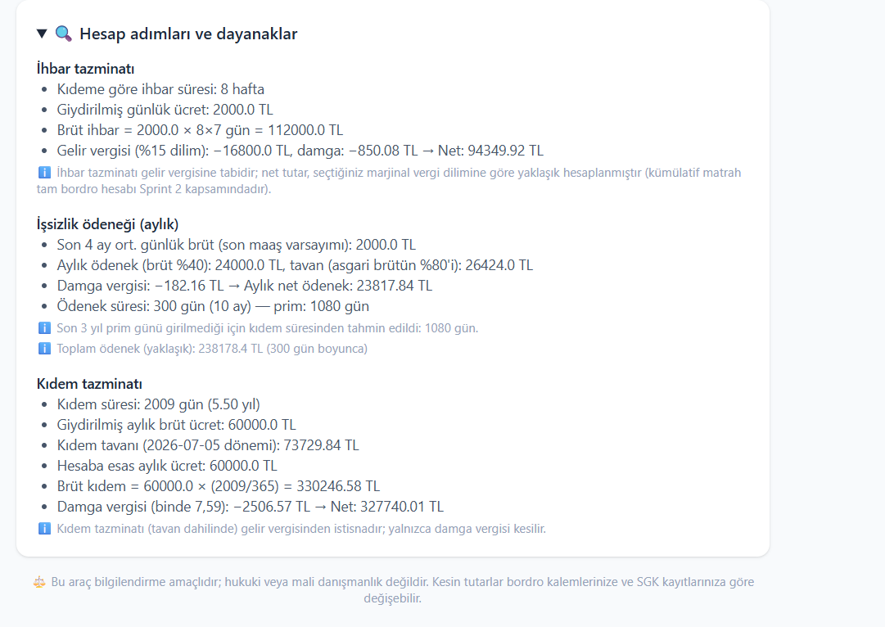

# Yapay Zeka ve Teknoloji Akademisi — Bootcamp 2026

## 👥 Takım Bilgileri

| Üye | Rol |
|---|---|
| **Taha Yavaş** | Scrum Master & Backend Developer |
| **Zuhal Tuana Yıldırım** | Product Owner & AI Developer |
| **Mühire Alkan** | Frontend Developer & UI Designer |

---

## 🚀 Ürün Bilgileri

### Ürün İsmi
**HakKazan** — AI-Powered Multi-Agent Compensation Calculator

### Ürün Açıklaması
HakKazan; çalışanların en kritik sorularından biri olan **"İşten ayrılırsam ne
alırım?"** sorusuna yanıt veren, çoklu yapay zekâ ajanları (multi-agent)
mimarisiyle çalışan bir kıdem tazminatı, ihbar tazminatı ve işsizlik ödeneği
hesaplama platformudur.

Mevcut internet hesaplayıcılarından temel farkı **güvenilirlik yaklaşımıdır**:
HakKazan'da tutarlar yapay zekâya hesaplatılmaz. Para hesabı, güncel mevzuat
parametreleriyle çalışan deterministik bir Python motorunda yapılır; yapay zekâ
ajanları kullanıcının serbest metin sorusunu yorumlar ve doğrulanmış sonucu
sade Türkçeyle açıklar. Aradaki **Critic (Doğrulayıcı) ajanı** ise her sonucu
hesap kodundan bağımsız kurallarla (tavan aşımı, hak tutarlılığı,
net = brüt − kesinti) çapraz kontrolden geçirir — bir ihlal tespit edilirse
hesap otomatik olarak yeniden çalıştırılır (Reflexion döngüsü).

### 🛠️ Teknik Altyapı & Mimari

| Katman | Teknoloji |
|---|---|
| Backend | Python · **Flask API** (dosya yükleme, hesap motoru, ajan orkestrasyonu) |
| AI & Orkestrasyon | **LangGraph** (LangChain ekosistemi) · **Google Gemini** |
| Frontend | HTML5 · Tailwind CSS · Vanilla JavaScript |
| Test | pytest (14 birim + uçtan uca test) |


**Şemanın izahı — akış soldan sağa şöyle işler:** Kullanıcı, frontend üzerinden
çalışma bilgilerini girer (isteğe bağlı belge yükler) ve serbest metinle sorusunu
sorar; Flask API bu isteği LangGraph orkestrasyon katmanına iletir.
**Planner Ajanı** (Gemini) soruyu yorumlayarak hangi kalemlerin (kıdem, ihbar,
işsizlik) hesaplanacağına karar verir. **Hesaplama Motoru** deterministik Python
fonksiyonlarıyla tutarları üretir — bu katmanda LLM yoktur, bu bilinçli bir
tasarım kararıdır: para hesabında olasılıksal model kullanılmaz. **Critic Ajanı**
sonuçları bağımsız doğrulama kurallarından geçirir; kırmızı okla gösterilen
geri dönüş kenarı Reflexion döngüsüdür — ihlal varsa hesap en fazla 3 kez
düzeltme talimatıyla yeniden çalıştırılır. Doğrulamadan geçen sonuç
**Insight Ajanı**na (Gemini) gider ve kullanıcının sorusuna doğrudan hitap eden
sade bir açıklamaya dönüştürülerek arayüze döner. Yeşil kutular LLM ajanlarını,
kırmızı kutular deterministik katmanları gösterir.

### ✨ Ürün Özellikleri (Sprint 1 itibarıyla)
* **Üç kalem tek ekranda:** Kıdem tazminatı, ihbar tazminatı ve işsizlik ödeneği
  — hak koşulları (1 yıl şartı, ayrılış şekline göre hak durumu, 600/900/1080
  prim günü eşikleri) otomatik denetlenir.
* **Dönemsel güncel mevzuat:** Kıdem tavanı (Tem–Ara 2026: 73.729,84 TL) ve
  brüt asgari ücret (2026: 33.030 TL) çıkış tarihine göre otomatik seçilir;
  yeni dönem açıklandığında tek dosyaya (`core/rules.py`) satır eklenir.
* **Çoklu ajan doğrulaması:** Hesap hatalarını yakalamak için tasarlanmış
  bağımsız Critic katmanı ve Reflexion (otomatik düzeltme) döngüsü.
* **Serbest metin soru:** "İstifa edersem ne kaybederim?" gibi sorular Planner
  ajanı tarafından yorumlanır.
* **Şeffaf hesap:** Her kalemin adım adım hesap dökümü ve yasal dayanak notları
  arayüzde gösterilir.
* **Belge yükleme altyapısı:** Bordro/belge güvenli şekilde alınır (PDF/PNG/JPG);
  otomatik bordro ayrıştırma (OCR) Sprint 2 kapsamındadır.

### 💰 Gelir Modeli (Small Bet)
Temel tek-kalem hesaplamalar ücretsiz; detaylı senaryo analizleri
("istifa vs çıkarılma", "3 ay daha çalışırsam ne değişir?"), karşılaştırmalı
tablolar ve tam PDF raporu premium modelle sunulacaktır.

### 🎯 Hedef Kitle
* Mevcut işinden ayrılmayı, istifa etmeyi veya ikale imzalamayı düşünen çalışanlar
* Haklarını tam ve doğru öğrenmek isteyen beyaz ve mavi yaka profesyoneller
* 18–65 yaş arası tüm sigortalı çalışanlar

---

## ⚙️ Kurulum ve Çalıştırma

```bash
pip install -r requirements.txt
cp .env.example .env          # GEMINI_API_KEY ekleyin (opsiyonel)
cd backend && python app.py   # http://localhost:5000
```

`GEMINI_API_KEY` tanımlı değilse uygulama **demo modunda** uçtan uca çalışır:
hesap ve doğrulama tam doğrulukta, açıklama şablonla üretilir.

**Testler:** `cd backend && python -m pytest tests/ -q`

---

## 📈 Proje Yönetimi & Ürün Durumu

### 📊 Product Backlog URL
* 📄 [`docs/backlog_raporlari.pdf`](docs/backlog_raporlari.pdf)

### 💬 Sprint 1 Daily Scrum Notları
Sprint boyunca yapılan dört toplantının (22, 26, 30 Haziran ve 4 Temmuz)
kişi bazlı yapıldı/yapılacak/engel raporları:
* 📄 [`docs/sprint1/toplanti_raporlari.pdf`](docs/toplanti_raporlari.pdf)

### 📌 Sprint 1 Board
*Sprint panosu Miro üzerinde tutulmaktadır (yukarıdaki bağlantı). Mavi kartlar
kullanıcı hikâyelerini (Story), kırmızı kartlar teknik görevleri (Task) temsil eder.*
<!-- Pano ekran görüntüsü alınca: docs/sprint1/board.png olarak kaydedip
     aşağıdaki satırın başındaki yorum işaretlerini kaldırın.

-->

### 🖼️ Ürün Durumu (Sprint 1 kapanış ekran görüntüleri)

**Bilgi girişi ve belge yükleme ekranı** — sürükle-bırak yükleme alanı,
çalışma bilgileri formu ve serbest metin soru kutusu:


**Sonuç ekranı** — üç kalemin özet kartları ve Critic doğrulama rozeti
(demo modu bildirimiyle birlikte):


**Hesap adımları ve dayanaklar** — her kalemin adım adım dökümü, dönemsel
kıdem tavanı seçimi ve yasal dayanak notları:



### 🗺️ Sprint 2 Yol Haritası
* Senaryo analizi ve karşılaştırma ("istifa vs çıkarılma vs ikale")
* Otomatik bordro ayrıştırma (OCR) ve alanların ön-doldurulması
* Kümülatif vergi matrahıyla tam ihbar neti
* Konuşma hafızası (takip soruları)

---

> ⚖️ HakKazan bilgilendirme amaçlıdır; hukuki veya mali danışmanlık değildir.
> Kesin tutarlar bordro kalemlerine ve SGK kayıtlarına göre değişebilir.
